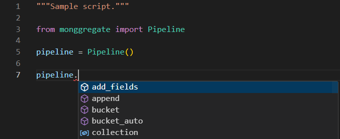

## **Installing Monggregate**

`monggregate` is available on PyPI:

```shell
pip install monggregate
```
## **Requirements**

It requires python > 3.10 and has a few required dependencies such as `pydantic`, `pyhumps` and `typing-extensions`.

In order to execute the useful query builder in the library, you will need a MongoDB driver.

For more details about the requirements, see the requirements files [in the repo](https://github.com/VianneyMI/monggregate/blob/main/requirements). 

## **First Steps**

There are several ways you may use Monggregate.

You can use the stages individually and build your pipeline step by step or you can use the `Pipeline` class to build your pipeline. That's actually the way I recommend you to use it.

In that case, your first steps will look like this:

```python

from monggregate import Pipeline

pipeline = Pipeline()
```

Now when writing,

```python

pipeline.
```

your IDE will show you the available stages.

You should see something like this.



In the [next page](pipeline.md), we will see in more details how to use the `Pipeline` class.